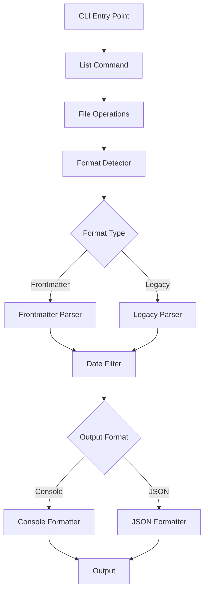

# feat: Phase 1 - sift CLI Tool Implementation Plan

## Summary

Build a lightweight CLI tool `sift` that lists and filters session summary files from `docs/sessions/*.md`, supporting date filtering and JSON output without database dependencies. This establishes the foundation for future full-text search capabilities.

---

## Problem Frame

Users need to quickly find and filter session summaries stored as markdown files with YAML frontmatter. Currently, there's no efficient way to list sessions by date range or export session metadata for programmatic use. Phase 1 provides essential browsing and filtering capabilities using direct file system operations, creating a solid foundation for Phase 2's advanced search features.

---

## Requirements

### Core Requirements
- **CLI Entry Point**: `sift list` command must be executable from any directory
- **Date Filtering**: `--since 2026-06-01` flag to filter sessions created on or after date
- **JSON Output**: `--json` flag for machine-readable output
- **Format Support**: Handle both new frontmatter format and legacy title-line format
- **Validation**: Warn when required frontmatter fields are missing
- **Display Format**: "YYYY-MM-DD  Title" with session count in console output

### Technical Requirements
- Parse YAML frontmatter using `gray-matter` library
- Read files directly from `docs/sessions/` directory
- Support ISO 8601 date format (YYYY-MM-DD)
- Handle file read errors gracefully
- Provide clear error messages for invalid dates

---

## Scope Boundaries

### In Scope
- `sift list` command with date filtering and JSON output
- Direct markdown file reading (no database)
- YAML frontmatter parsing
- Legacy format detection and parsing
- Basic validation and warnings
- Console and JSON output formatting

### Out of Scope
- Full-text search (deferred to Phase 2)
- SQLite database integration (deferred to Phase 2)
- BM25 ranking (deferred to Phase 2)
- Additional commands beyond `sift list`
- Complex filtering beyond date range
- Configuration files
- Session content modification

---

## Key Technical Decisions

### CLI Framework Selection
**Decision**: Use `commander` for CLI argument parsing

**Rationale**: Lightweight, well-maintained, provides clean API for subcommands and flags, minimal overhead compared to larger frameworks like yargs or oclif. Sufficient for Phase 1's simple needs while extensible for future commands.

### File Format Strategy
**Decision**: Support dual format detection

**Rationale**: 
- New format: YAML frontmatter with `date`, `title`, `summary`
- Legacy format: First line as `# Title: <value>`
- Auto-detect based on frontmatter presence
- Maintain backward compatibility during migration

### Error Handling Philosophy
**Decision**: Non-fatal warnings with clear messages

**Rationale**: 
- Missing frontmatter fields: warn but continue processing
- Invalid dates: clear error with format example
- File read errors: log and skip, don't abort
- Exit cleanly even with partial results

---

## Implementation Plan

### Phase 0: Project Setup

#### U1. Initialize project structure
**Goal**: Create directory layout and basic Node.js project configuration

**Dependencies**: None

**Files**:
- `tools/sift/package.json`
- `tools/sift/README.md`
- `tools/sift/.gitignore`

**Approach**: Initialize npm project with TypeScript configuration, set up directory structure for source code, tests, and documentation.

**Patterns to follow**: Standard Node.js package layout with `src/` for source files, `test/` for tests

**Test scenarios**:
- Verify package.json contains correct fields and scripts
- Verify TypeScript configuration is valid
- Verify .gitignore excludes node_modules and build artifacts

**Verification**: Project structure created, `npm install` completes successfully

---

### Phase 1: Core Dependencies

#### U2. Install dependencies
**Goal**: Install required npm packages with versions

**Dependencies**: U1

**Files**: `tools/sift/package.json`

**Approach**: Install exact versions to ensure reproducibility. Use `commander@^12.0.0`, `gray-matter@^4.0.3`, `dayjs@^1.11.10` for date parsing.

**Patterns to follow**: Semantic versioning with caret range (^) for minor updates

**Test expectation: none -- dependency installation only**

**Verification**: `npm install` completes without errors, all packages installed correctly

---

### Phase 2: File System Operations

#### U3. Implement session file discovery
**Goal**: Read and filter markdown files from `docs/sessions/` directory

**Dependencies**: U2

**Files**:
- `tools/sift/src/lib/file-operations.ts`
- `tools/sift/test/lib/file-operations.test.ts`

**Approach**: 
- Use Node.js `fs` module for directory scanning
- Filter for `.md` files only
- Sort files by modification date (newest first)
- Handle directory read errors gracefully

**Patterns to follow**: Async/await patterns, consistent error handling

**Test scenarios**:
- Happy path: Successfully read directory with multiple markdown files
- Edge case: Empty directory returns empty array
- Error path: Non-existent directory returns empty array with warning
- Edge case: Directory with no markdown files returns empty array
- Integration: Files are sorted by modification date

**Verification**: Unit tests pass, can read sample session files

---

#### U4. Implement session format detection
**Goal**: Detect frontmatter vs legacy format for each session file

**Dependencies**: U3

**Files**:
- `tools/sift/src/lib/format-detector.ts`
- `tools/sift/test/lib/format-detector.test.ts`

**Approach**:
- Use `gray-matter` to parse file content
- Check for frontmatter data presence
- Return format type (frontmatter/legacy/unknown)
- Handle invalid YAML gracefully

**Patterns to follow**: Type-safe return values, clear enum for format types

**Test scenarios**:
- Happy path: Frontmatter format detected correctly
- Happy path: Legacy format (no frontmatter) detected correctly
- Edge case: Empty file detected as unknown
- Error path: Invalid YAML detected as unknown with warning
- Edge case: Frontmatter with no data detected as frontmatter

**Verification**: Unit tests pass, correctly identifies various file formats

---

### Phase 3: Session Parsing

#### U5. Implement frontmatter session parser
**Goal**: Extract structured data from frontmatter format sessions

**Dependencies**: U4

**Files**:
- `tools/sift/src/lib/parsers/frontmatter-parser.ts`
- `tools/sift/test/lib/parsers/frontmatter-parser.test.ts`

**Approach**:
- Use `gray-matter` to parse YAML frontmatter
- Extract `date`, `title`, `summary` fields
- Validate required fields present
- Parse dates using `dayjs` for consistency
- Return structured session object

**Patterns to follow**: Validation with warnings, consistent object structure

**Test scenarios**:
- Happy path: Valid frontmatter parsed correctly with all fields
- Happy path: Frontmatter with date in various formats parsed correctly
- Edge case: Missing date field results in warning and null date
- Edge case: Missing title field results in warning and empty title
- Edge case: Missing summary field results in warning but continues
- Error path: Invalid date format results in warning and null date

**Verification**: Unit tests pass, correctly extracts and validates frontmatter data

---

#### U6. Implement legacy session parser
**Goal**: Extract data from legacy title-line format sessions

**Dependencies**: U4

**Files**:
- `tools/sift/src/lib/parsers/legacy-parser.ts`
- `tools/sift/test/lib/parsers/legacy-parser.test.ts`

**Approach**:
- Read first line of file
- Extract title using pattern `# Title: <value>`
- Use file modification time as date
- Return structured session object matching frontmatter format
- Handle various title line formats gracefully

**Patterns to follow**: Consistent output structure with frontmatter parser

**Test scenarios**:
- Happy path: Standard legacy format parsed correctly
- Edge case: Missing Title: prefix returns empty title
- Edge case: Empty file returns empty title
- Edge case: File with no matching line returns empty title
- Integration: Date from file stats matches actual modification time

**Verification**: Unit tests pass, correctly handles legacy format variations

---

### Phase 4: Session Filtering

#### U7. Implement date filtering
**Goal**: Filter sessions by date using `--since` flag

**Dependencies**: U5, U6

**Files**:
- `tools/sift/src/lib/filters/date-filter.ts`
- `tools/sift/test/lib/filters/date-filter.test.ts`

**Approach**:
- Parse `--since` date argument using `dayjs`
- Filter sessions where session date >= since date
- Handle invalid date format with clear error
- Support various date formats (YYYY-MM-DD, YYYY/MM/DD, etc.)

**Patterns to follow**: Functional filtering, clear error messages

**Test scenarios**:
- Happy path: Correctly filters sessions after given date
- Happy path: Includes sessions on exact date
- Edge case: No sessions match date range returns empty array
- Edge case: All sessions match date range returns all sessions
- Error path: Invalid date format throws clear error with example
- Integration: Works with sessions from both parsers

**Verification**: Unit tests pass, correctly filters sessions by date

---

### Phase 5: Output Formatting

#### U8. Implement console output formatter
**Goal**: Format sessions as "YYYY-MM-DD  Title" with count

**Dependencies**: U5, U6, U7

**Files**:
- `tools/sift/src/lib/formatters/console-formatter.ts`
- `tools/sift/test/lib/formatters/console-formatter.test.ts`

**Approach**:
- Format each session with date and title
- Format dates as YYYY-MM-DD
- Add session count at end
- Handle missing dates gracefully
- Sort sessions by date (descending)

**Patterns to follow**: Consistent formatting, aligned columns

**Test scenarios**:
- Happy path: Correctly formats single session
- Happy path: Correctly formats multiple sessions
- Happy path: Adds correct session count at end
- Edge case: Handles sessions with null/undefined dates
- Edge case: Handles sessions with empty titles
- Edge case: Empty session list shows count of 0

**Verification**: Unit tests pass, output matches expected format

---

#### U9. Implement JSON output formatter
**Goal**: Format sessions as JSON array for programmatic use

**Dependencies**: U5, U6, U7

**Files**:
- `tools/sift/src/lib/formatters/json-formatter.ts`
- `tools/sift/test/lib/formatters/json-formatter.test.ts`

**Approach**:
- Serialize sessions to JSON array
- Include date, title, summary, filename
- Sort by date (descending)
- Handle null/undefined values gracefully
- Use pretty-printed JSON (2-space indent)

**Patterns to follow**: Consistent JSON structure, proper escaping

**Test scenarios**:
- Happy path: Correctly formats single session as JSON
- Happy path: Correctly formats multiple sessions as JSON array
- Edge case: Handles sessions with null/undefined fields
- Edge case: Empty session list returns empty JSON array
- Integration: JSON can be parsed back to objects

**Verification**: Unit tests pass, JSON output is valid and parseable

---

### Phase 6: CLI Integration

#### U10. Implement CLI command interface
**Goal**: Create `sift list` command with `--since` and `--json` flags

**Dependencies**: U7, U8, U9

**Files**:
- `tools/sift/src/cli/list-command.ts`
- `tools/sift/src/cli/index.ts`
- `tools/sift/test/cli/list-command.test.ts`

**Approach**:
- Use `commander` to define `list` subcommand
- Add `--since` flag with date parsing
- Add `--json` flag for output format selection
- Coordinate file discovery, parsing, filtering, and formatting
- Handle errors and display appropriate messages
- Set appropriate exit codes

**Patterns to follow**: Commander patterns, clear flag documentation

**Test scenarios**:
- Happy path: `sift list` displays all sessions in console format
- Happy path: `sift list --since 2026-06-01` displays filtered sessions
- Happy path: `sift list --json` outputs valid JSON
- Happy path: `sift list --since 2026-06-01 --json` outputs filtered JSON
- Edge case: Invalid date format shows clear error message
- Edge case: No sessions found shows appropriate message
- Integration: End-to-end flow works correctly

**Verification**: CLI commands execute correctly, output matches expectations

---

#### U11. Create executable entry point
**Goal**: Make `sift` available as system command

**Dependencies**: U10

**Files**:
- `tools/sift/bin/sift`
- `tools/sift/package.json`

**Approach**:
- Create shell script entry point with shebang
- Configure package.json `bin` field
- Ensure executable permissions
- Link to compiled JavaScript

**Patterns to follow**: Standard npm bin configuration

**Test scenarios**:
- Happy path: `sift list` executes from command line
- Happy path: `sift list --help` displays help text
- Edge case: Works from different directories
- Integration: All flags work correctly from CLI

**Verification**: `sift` command is available and functional

---

### Phase 7: Build and Distribution

#### U12. Configure TypeScript build
**Goal**: Set up TypeScript compilation and build process

**Dependencies**: U11

**Files**:
- `tools/sift/tsconfig.json`
- `tools/sift/package.json`

**Approach**:
- Configure TypeScript for ES2022 target
- Set output directory to `dist/`
- Configure source maps for debugging
- Add build script to package.json

**Patterns to follow**: Standard TypeScript configuration

**Test expectation: none -- build configuration only**

**Verification**: `npm run build` completes successfully, generates dist/

---

## Output Structure

```
tools/sift/
├── bin/
│   └── sift                    # Executable entry point
├── src/
│   ├── cli/
│   │   ├── index.ts            # CLI entry point
│   │   └── list-command.ts     # List command implementation
│   ├── lib/
│   │   ├── file-operations.ts  # File system operations
│   │   ├── format-detector.ts  # Format detection logic
│   │   ├── parsers/
│   │   │   ├── frontmatter-parser.ts  # Frontmatter format parser
│   │   │   └── legacy-parser.ts       # Legacy format parser
│   │   ├── filters/
│   │   │   └── date-filter.ts  # Date filtering logic
│   │   └── formatters/
│   │       ├── console-formatter.ts   # Console output formatting
│   │       └── json-formatter.ts      # JSON output formatting
│   └── types/
│       └── session.ts          # TypeScript type definitions
├── test/
│   ├── cli/
│   │   └── list-command.test.ts
│   └── lib/
│       ├── file-operations.test.ts
│       ├── format-detector.test.ts
│       ├── parsers/
│       │   ├── frontmatter-parser.test.ts
│       │   └── legacy-parser.test.ts
│       ├── filters/
│       │   └── date-filter.test.ts
│       └── formatters/
│           ├── console-formatter.test.ts
│           └── json-formatter.test.ts
├── dist/                       # Compiled JavaScript (generated)
├── package.json
├── tsconfig.json
├── README.md
└── .gitignore
```

---

## Architecture Overview

### Module Interactions



### Extensibility for Phase 2

The architecture supports Phase 2 enhancements:

1. **Parser Interface**: Both parsers implement a common interface, making it easy to add new formats
2. **Filter Pipeline**: Date filter is one component in a pipeline; additional filters can be added
3. **Formatter Strategy**: Console/JSON formatters use a strategy pattern; new formats (CSV, TSV) can be added
4. **Session Type**: Structured session object maps directly to database schema for Phase 2
5. **Command Pattern**: List command follows commander pattern; new commands (search, inspect) can be added

---

## Error Handling Strategy

### Error Categories and Responses

| Error Type | Severity | Response | User Message |
|------------|----------|----------|--------------|
| Invalid date format | Error | Exit with code 1 | "Invalid date format: {value}. Use YYYY-MM-DD format." |
| Non-existent sessions directory | Warning | Continue, empty results | "Sessions directory not found: {path}" |
| File read error | Warning | Skip file | "Failed to read file {file}: {error}" |
| Missing frontmatter field | Warning | Use default value | "Missing {field} in {file}" |
| Invalid YAML in frontmatter | Warning | Treat as legacy format | "Invalid frontmatter in {file}, using legacy parser" |
| Empty sessions list | Info | Show zero count | "No sessions found" |

### Error Handling Implementation

```typescript
// Error handling patterns
try {
  // Operation
} catch (error) {
  if (error.code === 'ENOENT') {
    console.warn(`File not found: ${path}`);
    return defaultValue;
  }
  if (error instanceof SyntaxError) {
    console.warn(`Invalid data format: ${error.message}`);
    return fallbackValue;
  }
  // Critical error
  console.error(`Fatal error: ${error.message}`);
  process.exit(1);
}
```

---

## Testing Strategy

### Unit Test Coverage

Each module will have comprehensive unit tests:

- **File Operations**: Directory reading, error handling
- **Format Detector**: Frontmatter detection, legacy detection
- **Parsers**: Data extraction, validation, error handling
- **Filters**: Date parsing, filtering logic
- **Formatters**: Output formatting, special cases
- **CLI Commands**: Flag parsing, coordination

### Integration Test Scenarios

1. **End-to-end flow**: Read files → parse → filter → format → output
2. **Mixed format processing**: Handle both frontmatter and legacy in same run
3. **Date filtering integration**: Date parsing + filtering + sorting
4. **Error recovery**: Continue processing after encountering errors
5. **CLI integration**: All flag combinations work correctly

### Test Data Structure

```
test/fixtures/sessions/
├── frontmatter/
│   ├── complete.md          # Valid frontmatter with all fields
│   ├── missing-date.md      # Missing date field
│   ├── missing-title.md     # Missing title field
│   └── invalid-date.md      # Invalid date format
├── legacy/
│   ├── standard.md          # Standard legacy format
│   ├── no-prefix.md         # Missing Title: prefix
│   └── empty.md             # Empty file
└── empty/                   # Empty directory
```

### Test Implementation

- Use `jest` for testing framework
- Mock file system operations for isolation
- Use snapshot testing for output formatting
- Test both happy paths and edge cases
- Achieve >80% code coverage

---

## Installation Process

### Development Installation

```bash
cd tools/sift
npm install
npm run build
npm link  # Makes `sift` available globally
```

### Production Installation

```bash
cd tools/sift
npm install --production
npm run build
npm link
```

### Verification

```bash
# Verify installation
sift --version
sift list --help
sift list
sift list --since 2026-06-01
sift list --json
```

### Distribution

For wider distribution:

1. **npm publish** (if public package)
2. **Local npm install** with tarball
3. **Manual installation** via copying `dist/` and `bin/`

---

## Phase 2 Preparation

### Architectural Decisions for Future Enhancement

1. **Session Object Structure**: Matches database schema design
   - Fields: `date`, `title`, `summary`, `filename`
   - Type: TypeScript interface for compile-time safety

2. **Parser Abstraction**: Common interface for all parsers
   - `parse(content: string): Session | null`
   - Easy to add new formats without modifying CLI logic

3. **Filter Pipeline**: Composable filter functions
   - Type: `(sessions: Session[]) => Session[]`
   - Can add text search, tag filtering, etc.

4. **Formatter Strategy**: Extensible output formats
   - Interface: `format(sessions: Session[]): string`
   - Easy to add CSV, TSV, custom formats

### Database Migration Path

Phase 2 database integration considerations:

1. **Data Model**: Session object directly maps to database table
2. **Indexing Strategy**: Date field already indexed for filtering
3. **Full-Text Search**: Summary field ready for BM25 indexing
4. **Migration Script**: Can import existing markdown files to database

### Performance Considerations

1. **File Caching**: Currently reads all files; Phase 2 can cache in database
2. **Lazy Loading**: Could implement lazy loading for large session sets
3. **Streaming**: JSON formatter could stream output for large datasets
4. **Parallel Processing**: File reading could be parallelized

---

## Dependencies

### Production Dependencies

```json
{
  "commander": "^12.0.0",
  "gray-matter": "^4.0.3",
  "dayjs": "^1.11.10"
}
```

### Development Dependencies

```json
{
  "@types/node": "^20.0.0",
  "typescript": "^5.3.0",
  "jest": "^29.7.0",
  "@types/jest": "^29.5.0",
  "ts-jest": "^29.1.0"
}
```

---

## Success Criteria

### Functional Requirements
- [ ] `sift list` command executes successfully
- [ ] `--since` flag filters sessions by date
- [ ] `--json` flag outputs valid JSON
- [ ] Both frontmatter and legacy formats are supported
- [ ] Missing fields generate appropriate warnings
- [ ] Invalid dates produce clear error messages
- [ ] Sessions are sorted by date (descending)

### Non-Functional Requirements
- [ ] Response time < 1 second for typical session directories
- [ ] Memory usage < 100MB for directories with 1000+ sessions
- [ ] Test coverage > 80%
- [ ] Zero TypeScript errors
- [ ] Clear error messages for all failure modes

### User Experience
- [ ] Help text is clear and comprehensive
- [ ] Console output is readable and well-formatted
- [ ] JSON output is valid and parseable
- [ ] Error messages are actionable
- [ ] Installation process is straightforward

---

## Risk Analysis

### Technical Risks

| Risk | Impact | Probability | Mitigation |
|------|--------|-------------|------------|
| File system performance with large directories | High | Low | Add file system caching, limit directory size |
| YAML parsing errors in malformed files | Medium | High | Graceful fallback to legacy parser, clear warnings |
| Date format variations causing parsing failures | Medium | Medium | Support multiple date formats, clear error messages |
| TypeScript compilation issues | Low | Low | Strict type checking, continuous integration |

### Operational Risks

| Risk | Impact | Probability | Mitigation |
|------|--------|-------------|------------|
| Breaking changes to `gray-matter` or `commander` | Medium | Low | Lock versions, monitor updates |
| Session directory structure changes | Medium | Low | Make directory path configurable |
| Performance degradation as session count grows | High | Medium | Design for database migration in Phase 2 |

---

## Timeline Estimate

- **Phase 0-1**: Project setup and dependencies: 1 hour
- **Phase 2-3**: File operations and parsing: 3-4 hours
- **Phase 4**: Filtering: 1-2 hours
- **Phase 5**: Output formatting: 2 hours
- **Phase 6**: CLI integration: 2-3 hours
- **Phase 7**: Build and testing: 2-3 hours

**Total**: 11-15 hours for complete implementation and testing

---

## Verification Checklist

Before declaring Phase 1 complete:

- [ ] All unit tests pass
- [ ] Integration tests pass
- [ ] CLI commands work correctly
- [ ] Help text is complete
- [ ] Error messages are clear
- [ ] Code follows TypeScript best practices
- [ ] Test coverage exceeds 80%
- [ ] README documentation is complete
- [ ] Installation instructions work
- [ ] `sift list` works from any directory
- [ ] Date filtering works correctly
- [ ] JSON output is valid
- [ ] Both session formats supported
- [ ] No TypeScript compilation errors
- [ ] No runtime errors in normal operation

---

## Future Considerations

### Potential Enhancements (Post-Phase 2)
- Additional filters: by tags, author, status
- More output formats: CSV, TSV, Markdown table
- Session inspection: `sift inspect <file>` for detailed view
- Session export: `sift export --format pdf`
- Configuration file for default options
- Auto-refresh on file changes
- Interactive mode with fzf-like selection

### Maintenance Notes
- Monitor `gray-matter` and `commander` for security updates
- Track TypeScript version compatibility
- Document any session format changes
- Keep test fixtures up to date
- Monitor performance as session count grows

---

**Status**: Ready for implementation
**Created**: 2026-06-08
**Priority**: High