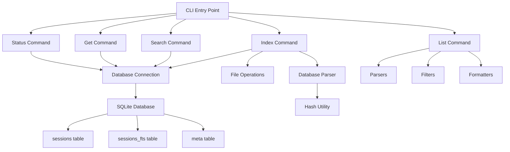

# feat: Phase 2 - SQLite Index + BM25 Search Implementation Plan

## Summary

Build SQLite FTS5 + BM25 search capabilities for the sift CLI tool, enabling fast full-text search across session summaries with incremental indexing. This adds 4 new commands (`index`, `search`, `get`, `status`) to the existing Phase 1 foundation.

---

## Problem Frame

Users (primarily AI agents calling `sift search`, secondarily humans via terminal) need to quickly search across session summaries stored as markdown files in `docs/sessions/`. Current Phase 1 implementation provides listing and filtering but no search capability. Phase 2 adds SQLite FTS5 + BM25 full-text search with incremental indexing, hash-based change detection, and relevance-ranked results.

---

## Requirements

### Core Requirements

**Functional Requirements:**
- **`sift index`**: Incremental indexing of `docs/sessions/*.md` files with hash-based change detection
- **`sift search "<query>"`**: Full-text search with BM25 ranking, date filtering, and result limiting
- **`sift get <slug>`**: Retrieve full session record including frontmatter and body
- **`sift status`**: Index health check showing file count, row count, and index timestamp

**Technical Requirements:**
- SQLite FTS5 for full-text search with BM25 ranking
- SHA256 hash-based incremental indexing (only index changed files)
- Database storage at `~/.sift/index.sqlite` (user home directory)
- Dual storage for `files_touched`: JSON array (sessions table) + flattened text (FTS5 table)
- BM25 weights: short_summary=3, title=2, files_touched=1.5, body=1
- Date filtering support in search command
- Configurable result limit (default 5)
- Graceful database initialization on first run

### Database Schema Requirements

**`sessions` table:**
```sql
CREATE TABLE sessions (
  slug TEXT PRIMARY KEY,        -- filename without .md, e.g. "2026-06-07-summarise-skill-opencode"
  date TEXT,                    -- ISO 8601 date
  title TEXT,                   -- session title
  files_touched TEXT,           -- JSON array as string
  files_touched_fts TEXT,       -- Flattened space-separated paths for FTS5
  short_summary TEXT,           -- session summary (3-5 lines)
  body TEXT,                    -- full markdown body after frontmatter
  hash TEXT,                    -- SHA256 of raw file content
  indexed_at TEXT               -- ISO 8601 timestamp
);
```

**`sessions_fts` table (FTS5 virtual table):**
```sql
CREATE VIRTUAL TABLE sessions_fts USING fts5(
  title,
  short_summary,
  files_touched_fts,
  body,
  content=sessions,
  content_rowid=rowid
);
```

**`meta` table:**
```sql
CREATE TABLE meta (
  key TEXT PRIMARY KEY,
  value TEXT
);
-- Store metadata: indexed_at, version, etc.
```

---

## Scope Boundaries

### In Scope
- SQLite database creation and initialization
- FTS5 full-text search with BM25 ranking
- Incremental indexing with hash-based change detection
- 4 new commands: `index`, `search`, `get`, `status`
- Date filtering in search (`--since` flag)
- Result limiting (`--limit` flag)
- Dual storage for files_touched (JSON + flattened text)
- Database initialization on first run
- Git exclusion of `.sift/` directory

### Out of Scope
- Deletion reconciliation (removed files keep stale rows - acceptable for now)
- Hybrid/semantic search (deferred to Phase 3)
- File watcher/auto-refresh (deferred to Phase 4)
- Advanced search modes (`--bm25`, `--hybrid` flags)
- `--sessions-dir` flag (use CWD relative paths)
- Multi-database support
- Database migration scripts (fresh install only)

---

## Key Technical Decisions

### Database Location Strategy

**Decision**: Store database at `~/.sift/index.sqlite`

**Rationale**:
- Works from any repository directory (user doesn't need to be in specific repo)
- Survives repo clones/updates (database persists)
- Standard CLI tool pattern (similar to `~/.gitconfig`, `~/.npm`, etc.)
- Multi-repo use case: one user can have multiple repos with `docs/sessions/`
- GitHub installation scenario: `npm install -g @agent-skills/sift` works anywhere
- Trade-off: Database not tracked in git (correct behavior - derived data, not source)

**Implementation**:
```typescript
const dbDir = path.join(os.homedir(), '.sift');
const dbPath = path.join(dbDir, 'index.sqlite');

// Create directory on first run
if (!fs.existsSync(dbDir)) {
  fs.mkdirSync(dbDir, { recursive: true });
}
```

### Sessions Directory Strategy

**Decision**: Keep relative to CWD (same as Phase 1)

**Approach**:
- Primary: `./docs/sessions/` relative to current working directory
- Error handling: Clear error if directory doesn't exist
- Consistency with Phase 1 behavior

**Rationale**:
- Standard project structure assumption
- Enables multi-repo workflow: `cd repo1 && sift search "X"` vs `cd repo2 && sift search "Y"`
- Simplicity - no configuration required

### files_touched Storage Strategy

**Decision**: Dual storage - JSON in `sessions` table + flattened text in `sessions_fts`

**Implementation**:
```typescript
// In sessions table (preserves structure)
files_touched: '["src/cli/index.ts", "src/lib/parsers/*.ts"]'

// In sessions_fts table (enables search)
files_touched_fts: 'src/cli/index.ts src/lib/parsers/*.ts'
```

**Rationale**:
- `sessions.files_touched` (JSON): Preserves structure for `sift get <slug>` output
- `sessions_fts.files_touched_fts` (flattened): Enables FTS5 search on file paths
- Search benefit: `sift search "index.ts"` finds sessions that touched `index.ts`
- Technical: Minimal storage overhead, enables both structured retrieval AND search

### SQLite Library Selection

**Decision**: Use `better-sqlite3`

**Rationale**:
- Synchronous API (simpler than async callbacks)
- High performance and stability
- Type-safe TypeScript support
- Actively maintained
- FTS5 support built-in

### Hash Strategy

**Decision**: SHA256 hash of raw file content

**Implementation**:
```typescript
import { createHash } from 'crypto';

function computeHash(content: string): string {
  return createHash('sha256').update(content).digest('hex');
}
```

**Rationale**:
- Cryptographic hash (low collision probability)
- Built-in Node.js crypto module (no external dependency)
- Fast computation for file change detection
- Standard approach for incremental indexing

---

## Command Specifications

### `sift index`

**Purpose**: Incremental indexing of session files with hash-based change detection

**Usage**:
```bash
sift index
```

**Behavior**:
1. Walk `docs/sessions/*.md` directory (relative to CWD)
2. For each file:
   - Read file content
   - Parse frontmatter using `gray-matter` to extract fields
   - Compute SHA256 hash of raw file content
   - Check database for existing row with matching slug
   - If no row exists → INSERT into `sessions` + `sessions_fts`
   - If row exists and hash differs → UPDATE row + rebuild `sessions_fts` entry
   - If row exists and hash matches → skip (no changes)
3. Update `meta.indexed_at` to current timestamp
4. Print summary: `N indexed, M updated, K skipped`

**Output Format**:
```
Indexed 5 sessions
Updated 2 sessions
Skipped 10 sessions
Last indexed: 2026-06-13T10:30:00Z
```

**Error Handling**:
- Clear error if `docs/sessions/` directory doesn't exist
- Warning for files that fail to parse
- Continue processing even if some files fail

---

### `sift search`

**Purpose**: Full-text search with BM25 ranking

**Usage**:
```bash
sift search "<query>"
sift search "<query>" --since 2026-06-01
sift search "<query>" --limit 3
```

**Behavior**:
1. Execute FTS5 query with BM25 ranking:
   ```sql
   SELECT s.slug, s.date, s.title, s.short_summary, bm25(sessions_fts, 3.0, 2.0, 1.5, 1.0) as score
   FROM sessions_fts
   JOIN sessions s ON s.rowid = sessions_fts.rowid
   WHERE sessions_fts MATCH ?
   ORDER BY score ASC
   LIMIT ?
   ```
2. BM25 weights: short_summary=3, title=2, files_touched_fts=1.5, body=1
3. Apply `--since` date filter if provided (date >= specified date)
4. Apply `--limit` (default 5)
5. Format output with relevance score

**Output Format**:
```
score: 0.234  2026-06-09  Sift CLI Phase 1 Implementation
  Built complete sift CLI tool with list command, date filtering (--since),
  JSON output, dual format support (frontmatter + legacy), 77% test coverage.

score: 1.456  2026-06-07  Summarise skill creation and opencode installation
  Created the /summarise skill with YAML frontmatter, structured body...

2 results
```

**Error Handling**:
- Clear error if query is empty
- Clear error if database doesn't exist (run `sift index` first)
- Empty results message if no matches

---

### `sift get`

**Purpose**: Retrieve full session record

**Usage**:
```bash
sift get <slug>
```

**Example**:
```bash
sift get session_summary_2026-06-09-sift-cli-phase1-implementation
```

**Behavior**:
1. Query database by slug:
   ```sql
   SELECT slug, date, title, files_touched, short_summary, body, indexed_at
   FROM sessions
   WHERE slug = ?
   ```
2. Display all fields in formatted output
3. Show `files_touched` as JSON array (pretty-printed)

**Output Format**:
```
Slug: session_summary_2026-06-09-sift-cli-phase1-implementation
Date: 2026-06-09
Title: Sift CLI Phase 1 Implementation
Indexed: 2026-06-13T10:30:00Z

Files Touched:
- src/cli/index.ts
- src/lib/parsers/*.ts
- docs/plans/2026-06-08-*.md

Summary:
Built complete sift CLI tool with list command, date filtering (--since),
JSON output, dual format support (frontmatter + legacy), 77% test coverage.

Body:
# Session Summary — 2026-06-09

This session focused on implementing Phase 1 of the sift CLI tool...
```

**Error Handling**:
- Clear error if slug doesn't exist
- Clear error if database doesn't exist

---

### `sift status`

**Purpose**: Index health check

**Usage**:
```bash
sift status
```

**Behavior**:
1. Count files in `docs/sessions/` directory
2. Count rows in `sessions` table
3. Retrieve `meta.indexed_at` timestamp
4. Compare file count vs row count
5. Display summary

**Output Format**:
```
Sessions directory: docs/sessions/
Files on disk: 15
Sessions indexed: 15
Status: All files indexed ✅
Last indexed: 2026-06-13T10:30:00Z
Database: ~/.sift/index.sqlite
```

**Or with mismatch:**
```
Sessions directory: docs/sessions/
Files on disk: 15
Sessions indexed: 12
Status: 3 files not indexed - run 'sift index' ⚠️
Last indexed: 2026-06-13T10:30:00Z
Database: ~/.sift/index.sqlite
```

**Error Handling**:
- Clear error if `docs/sessions/` doesn't exist
- Clear error if database doesn't exist

---

## Implementation Plan

### Phase 0: Project Setup (1 hour)

#### U0.1. Add SQLite dependencies

**Files**: `tools/sift/package.json`

**Approach**: Add `better-sqlite3` to dependencies

**Dependencies**: None

```bash
cd tools/sift
npm install better-sqlite3
npm install --save-dev @types/better-sqlite3
```

**Verification**: `npm list better-sqlite3` shows installed version

---

#### U0.2. Update .gitignore for database directory

**Files**: `tools/sift/.gitignore`

**Approach**: Add `.sift/` and `~/.sift/` patterns

**Dependencies**: U0.1

```bash
cat >> .gitignore << 'EOF'

# SQLite database directory
.sift/
~/.sift/
EOF
```

**Verification**: `cat .gitignore` shows `.sift/` patterns

---

### Phase 1: Database Layer (2 hours)

#### U1.1. Create database schema

**Files**:
- `tools/sift/src/lib/database/schema.ts`
- `tools/sift/test/lib/database/schema.test.ts`

**Approach**:
- Define schema initialization function
- Create `sessions`, `sessions_fts`, `meta` tables
- Add database version tracking in `meta` table

**Dependencies**: U0.1

```typescript
// src/lib/database/schema.ts
import Database from 'better-sqlite3';
import path from 'path';
import os from 'os';

export function initializeDatabase(dbPath: string): Database.Database {
  const db = new Database(dbPath);

  // Enable foreign keys
  db.pragma('foreign_keys = ON');

  // Create sessions table
  db.exec(`
    CREATE TABLE IF NOT EXISTS sessions (
      slug TEXT PRIMARY KEY,
      date TEXT,
      title TEXT,
      files_touched TEXT,
      files_touched_fts TEXT,
      short_summary TEXT,
      body TEXT,
      hash TEXT,
      indexed_at TEXT
    )
  `);

  // Create FTS5 virtual table
  db.exec(`
    CREATE VIRTUAL TABLE IF NOT EXISTS sessions_fts USING fts5(
      title,
      short_summary,
      files_touched_fts,
      body,
      content=sessions,
      content_rowid=rowid
    )
  `);

  // Create meta table
  db.exec(`
    CREATE TABLE IF NOT EXISTS meta (
      key TEXT PRIMARY KEY,
      value TEXT
    )
  `);

  return db;
}

export function getDatabasePath(): string {
  const dbDir = path.join(os.homedir(), '.sift');
  return path.join(dbDir, 'index.sqlite');
}
```

**Test scenarios**:
- Happy path: Database file created with all tables
- Happy path: Re-running initialization doesn't fail (IF NOT EXISTS)
- Integration: All tables have correct schema

**Verification**: Unit tests pass, database file created at `~/.sift/index.sqlite`

---

#### U1.2. Implement database connection management

**Files**:
- `tools/sift/src/lib/database/connection.ts`
- `tools/sift/test/lib/database/connection.test.ts`

**Approach**:
- Singleton database connection
- Create `.sift/` directory if it doesn't exist
- Graceful error handling

**Dependencies**: U1.1

```typescript
// src/lib/database/connection.ts
import Database from 'better-sqlite3';
import fs from 'fs';
import path from 'path';
import os from 'os';
import { initializeDatabase, getDatabasePath } from './schema';

let db: Database.Database | null = null;

export function getDatabase(): Database.Database {
  if (!db) {
    const dbPath = getDatabasePath();
    const dbDir = path.dirname(dbPath);

    // Create directory if it doesn't exist
    if (!fs.existsSync(dbDir)) {
      fs.mkdirSync(dbDir, { recursive: true });
    }

    db = initializeDatabase(dbPath);
  }

  return db;
}

export function closeDatabase(): void {
  if (db) {
    db.close();
    db = null;
  }
}
```

**Test scenarios**:
- Happy path: Database connection established
- Happy path: Directory created if it doesn't exist
- Edge case: Multiple calls to `getDatabase()` return same instance
- Integration: Database file created in correct location

**Verification**: Unit tests pass, database file at `~/.sift/index.sqlite`

---

### Phase 2: Index Command (2 hours)

#### U2.1. Implement hash computation utility

**Files**:
- `tools/sift/src/lib/utils/hash.ts`
- `tools/sift/test/lib/utils/hash.test.ts`

**Approach**:
- Use Node.js built-in `crypto` module
- SHA256 hash of string content

**Dependencies**: None

```typescript
// src/lib/utils/hash.ts
import { createHash } from 'crypto';

export function computeHash(content: string): string {
  return createHash('sha256').update(content).digest('hex');
}
```

**Test scenarios**:
- Happy path: Same content produces same hash
- Happy path: Different content produces different hash
- Integration: Hash is hex string

**Verification**: Unit tests pass

---

#### U2.2. Implement file-to-session parsing for database

**Files**:
- `tools/sift/src/lib/parsers/database-parser.ts`
- `tools/sift/test/lib/parsers/database-parser.test.ts`

**Approach**:
- Parse markdown file using `gray-matter`
- Extract frontmatter fields: `date`, `title`, `files_touched`, `short_summary`
- Extract body content (content after frontmatter)
- Generate slug from filename (remove .md extension)
- Compute SHA256 hash of raw content

**Dependencies**: U2.1

```typescript
// src/lib/parsers/database-parser.ts
import matter from 'gray-matter';
import { Session } from '../../types/session';
import { computeHash } from '../utils/hash';

export interface DatabaseSession extends Session {
  files_touched: string;
  files_touched_fts: string;
  short_summary: string;
  body: string;
  hash: string;
}

export function parseSessionForDatabase(
  content: string,
  filename: string
): DatabaseSession | null {
  try {
    const slug = filename.replace(/\.md$/, '');
    const hash = computeHash(content);
    const parsed = matter(content);
    const data = parsed.data as any;

    // Extract frontmatter fields
    const date = data.date || null;
    const title = data.title || '';
    const filesTouched = data.files_touched || '[]';
    const shortSummary = data.short_summary || '';
    const body = parsed.content || '';

    // Flatten files_touched for FTS5
    let filesTouchedFts = '';
    try {
      const filesArray = JSON.parse(filesTouched);
      filesTouchedFts = Array.isArray(filesArray) ? filesArray.join(' ') : '';
    } catch {
      filesTouchedFts = '';
    }

    return {
      date,
      title,
      summary: shortSummary,
      filename,
      files_touched: filesTouched,
      files_touched_fts: filesTouchedFts,
      short_summary: shortSummary,
      body,
      hash,
    };
  } catch (error) {
    console.warn(`Failed to parse session ${filename}: ${error}`);
    return null;
  }
}
```

**Test scenarios**:
- Happy path: Valid frontmatter session parsed correctly
- Happy path: files_touched array flattened correctly
- Edge case: Invalid JSON in files_touched returns empty string
- Edge case: Missing fields handled gracefully

**Verification**: Unit tests pass

---

#### U2.3. Implement index command

**Files**:
- `tools/sift/src/cli/index-command.ts`
- `tools/sift/test/cli/index-command.test.ts`

**Approach**:
- Walk `docs/sessions/` directory
- For each file: parse and compute hash
- Compare with existing hash in database
- Insert/update/skip based on hash comparison
- Update `meta.indexed_at` timestamp
- Print summary statistics

**Dependencies**: U2.2, U1.2

```typescript
// src/cli/index-command.ts
import { Command } from 'commander';
import path from 'path';
import * as fs from 'fs';
import { getDatabase } from '../lib/database/connection';
import { listSessionFiles, readFileContent } from '../lib/file-operations';
import { parseSessionForDatabase } from '../lib/parsers/database-parser';

export function createIndexCommand(): Command {
  const command = new Command('index')
    .description('Index session files in database')
    .action(async () => {
      try {
        const sessionsDir = path.join(process.cwd(), 'docs', 'sessions');

        // Check if directory exists
        if (!fs.existsSync(sessionsDir)) {
          console.error(`Sessions directory not found: ${sessionsDir}`);
          process.exit(1);
        }

        // List session files
        const files = await listSessionFiles(sessionsDir);

        if (files.length === 0) {
          console.log('No session files found');
          return;
        }

        const db = getDatabase();

        let indexed = 0;
        let updated = 0;
        let skipped = 0;

        // Prepare statements
        const insertStmt = db.prepare(`
          INSERT INTO sessions
          (slug, date, title, files_touched, files_touched_fts, short_summary, body, hash, indexed_at)
          VALUES (?, ?, ?, ?, ?, ?, ?, ?, ?)
        `);

        const updateStmt = db.prepare(`
          UPDATE sessions
          SET date = ?, title = ?, files_touched = ?, files_touched_fts = ?,
              short_summary = ?, body = ?, hash = ?, indexed_at = ?
          WHERE slug = ?
        `);

        const deleteFtsStmt = db.prepare(`DELETE FROM sessions_fts WHERE rowid = ?`);
        const insertFtsStmt = db.prepare(`
          INSERT INTO sessions_fts (rowid, title, short_summary, files_touched_fts, body)
          VALUES (?, ?, ?, ?, ?)
        `);

        const getRowidStmt = db.prepare(`SELECT rowid FROM sessions WHERE slug = ?`);
        const getHashStmt = db.prepare(`SELECT hash FROM sessions WHERE slug = ?`);

        // Index each file
        for (const file of files) {
          const filePath = path.join(sessionsDir, file);
          const content = await readFileContent(filePath);

          if (!content) {
            console.warn(`Failed to read file: ${file}`);
            continue;
          }

          const session = parseSessionForDatabase(content, file);
          if (!session) {
            console.warn(`Failed to parse session: ${file}`);
            continue;
          }

          const slug = file.replace(/\.md$/, '');

          // Check if session exists and get its hash
          const existing = getHashStmt.get(slug) as { hash: string } | undefined;

          if (!existing) {
            // Insert new session
            const info = insertStmt.run(
              session.date || null,
              session.title,
              session.files_touched,
              session.files_touched_fts,
              session.short_summary,
              session.body,
              session.hash,
              new Date().toISOString()
            );

            // Insert into FTS5 table
            insertFtsStmt.run(
              info.lastInsertRowid,
              session.title,
              session.short_summary,
              session.files_touched_fts,
              session.body
            );

            indexed++;
          } else if (existing.hash !== session.hash) {
            // Update existing session
            updateStmt.run(
              session.date || null,
              session.title,
              session.files_touched,
              session.files_touched_fts,
              session.short_summary,
              session.body,
              session.hash,
              new Date().toISOString(),
              slug
            );

            // Rebuild FTS5 entry
            const rowidResult = getRowidStmt.get(slug) as { rowid: number } | undefined;
            if (rowidResult) {
              deleteFtsStmt.run(rowidResult.rowid);
              insertFtsStmt.run(
                rowidResult.rowid,
                session.title,
                session.short_summary,
                session.files_touched_fts,
                session.body
              );
            }

            updated++;
          } else {
            skipped++;
          }
        }

        // Update meta.indexed_at
        const updateMetaStmt = db.prepare(`
          INSERT INTO meta (key, value) VALUES ('indexed_at', ?)
          ON CONFLICT(key) DO UPDATE SET value = excluded.value
        `);
        updateMetaStmt.run(new Date().toISOString());

        // Print summary
        console.log(`Indexed ${indexed} sessions`);
        console.log(`Updated ${updated} sessions`);
        console.log(`Skipped ${skipped} sessions`);
        console.log(`Last indexed: ${new Date().toISOString()}`);

      } catch (error) {
        if (error instanceof Error) {
          console.error(error.message);
          process.exit(1);
        }
        console.error('An unexpected error occurred');
        process.exit(1);
      }
    });

  return command;
}
```

**Test scenarios**:
- Happy path: Index fresh directory
- Happy path: Re-index with no changes (all skipped)
- Happy path: Re-index with changes (updates detected)
- Edge case: Empty directory
- Integration: Database contains correct data after indexing

**Verification**: Unit tests pass, manual testing with real session files

---

### Phase 3: Search Command (2 hours)

#### U3.1. Implement search command

**Files**:
- `tools/sift/src/cli/search-command.ts`
- `tools/sift/test/cli/search-command.test.ts`

**Approach**:
- Execute FTS5 query with BM25 ranking
- Apply date filter (`--since`) if provided
- Apply limit (`--limit`, default 5)
- Format output with relevance score

**Dependencies**: U1.2

```typescript
// src/cli/search-command.ts
import { Command } from 'commander';
import { getDatabase } from '../lib/database/connection';

export function createSearchCommand(): Command {
  const command = new Command('search')
    .description('Search sessions using full-text search')
    .argument('<query>', 'Search query')
    .option('--since <date>', 'Filter sessions from this date onwards (YYYY-MM-DD)')
    .option('--limit <n>', 'Maximum number of results', '5')
    .action(async (query, options) => {
      try {
        if (!query || query.trim() === '') {
          console.error('Search query cannot be empty');
          process.exit(1);
        }

        const db = getDatabase();
        const limit = parseInt(options.limit, 10);

        if (isNaN(limit) || limit < 1) {
          console.error('Limit must be a positive integer');
          process.exit(1);
        }

        // Build query
        let sql = `
          SELECT s.slug, s.date, s.title, s.short_summary, bm25(sessions_fts, 3.0, 2.0, 1.5, 1.0) as score
          FROM sessions_fts
          JOIN sessions s ON s.rowid = sessions_fts.rowid
          WHERE sessions_fts MATCH ?
        `;

        const params: any[] = [query];

        // Add date filter if provided
        if (options.since) {
          sql += ` AND s.date >= ?`;
          params.push(options.since);
        }

        sql += ` ORDER BY score ASC LIMIT ?`;
        params.push(limit);

        // Execute query
        const results = db.prepare(sql).all(...params) as Array<{
          slug: string;
          date: string | null;
          title: string;
          short_summary: string;
          score: number;
        }>;

        // Display results
        if (results.length === 0) {
          console.log('No results found');
          return;
        }

        for (const result of results) {
          const score = result.score.toFixed(3);
          const date = result.date || 'Unknown Date';
          console.log(`score: ${score}  ${date}  ${result.title}`);
          console.log(`  ${result.short_summary}`);
          console.log('');
        }

        console.log(`${results.length} result${results.length !== 1 ? 's' : ''}`);

      } catch (error) {
        if (error instanceof Error) {
          console.error(error.message);
          process.exit(1);
        }
        console.error('An unexpected error occurred');
        process.exit(1);
      }
    });

  return command;
}
```

**Test scenarios**:
- Happy path: Search returns relevant results
- Happy path: Results sorted by relevance score
- Happy path: Date filter works correctly
- Happy path: Limit parameter works correctly
- Edge case: Empty query produces error
- Edge case: No matches produces empty message

**Verification**: Unit tests pass, manual testing with real sessions

---

### Phase 4: Get Command (1 hour)

#### U4.1. Implement get command

**Files**:
- `tools/sift/src/cli/get-command.ts`
- `tools/sift/test/cli/get-command.test.ts`

**Approach**:
- Query database by slug
- Display all fields in formatted output
- Pretty-print files_touched as JSON

**Dependencies**: U1.2

```typescript
// src/cli/get-command.ts
import { Command } from 'commander';
import { getDatabase } from '../lib/database/connection';

export function createGetCommand(): Command {
  const command = new Command('get')
    .description('Get session by slug')
    .argument('<slug>', 'Session slug (filename without .md)')
    .action(async (slug) => {
      try {
        const db = getDatabase();

        const result = db.prepare(`
          SELECT slug, date, title, files_touched, short_summary, body, indexed_at
          FROM sessions
          WHERE slug = ?
        `).get(slug) as {
          slug: string;
          date: string | null;
          title: string;
          files_touched: string;
          short_summary: string;
          body: string;
          indexed_at: string;
        } | undefined;

        if (!result) {
          console.error(`Session not found: ${slug}`);
          process.exit(1);
        }

        // Display session
        console.log(`Slug: ${result.slug}`);
        console.log(`Date: ${result.date || 'Unknown Date'}`);
        console.log(`Title: ${result.title}`);
        console.log(`Indexed: ${result.indexed_at}`);
        console.log('');

        // Display files touched
        let filesTouched;
        try {
          filesTouched = JSON.parse(result.files_touched);
        } catch {
          filesTouched = [];
        }

        if (Array.isArray(filesTouched) && filesTouched.length > 0) {
          console.log('Files Touched:');
          filesTouched.forEach((file: string) => console.log(`- ${file}`));
          console.log('');
        }

        // Display summary
        console.log('Summary:');
        console.log(result.short_summary);
        console.log('');

        // Display body
        console.log('Body:');
        console.log(result.body);

      } catch (error) {
        if (error instanceof Error) {
          console.error(error.message);
          process.exit(1);
        }
        console.error('An unexpected error occurred');
        process.exit(1);
      }
    });

  return command;
}
```

**Test scenarios**:
- Happy path: Retrieve existing session
- Edge case: Non-existent session produces error
- Integration: All fields displayed correctly

**Verification**: Unit tests pass, manual testing

---

### Phase 5: Status Command (1 hour)

#### U5.1. Implement status command

**Files**:
- `tools/sift/src/cli/status-command.ts`
- `tools/sift/test/cli/status-command.test.ts`

**Approach**:
- Count files in `docs/sessions/` directory
- Count rows in `sessions` table
- Retrieve `meta.indexed_at` timestamp
- Display summary with status indicator

**Dependencies**: U1.2

```typescript
// src/cli/status-command.ts
import { Command } from 'commander';
import { getDatabase } from '../lib/database/connection';
import { listSessionFiles } from '../lib/file-operations';
import path from 'path';

export function createStatusCommand(): Command {
  const command = new Command('status')
    .description('Show index status')
    .action(async () => {
      try {
        const sessionsDir = path.join(process.cwd(), 'docs', 'sessions');
        const db = getDatabase();

        // Count files on disk
        const files = await listSessionFiles(sessionsDir);
        const fileCount = files.length;

        // Count sessions in database
        const sessionCount = db.prepare(`SELECT COUNT(*) as count FROM sessions`)
          .get() as { count: number };

        // Get indexed_at timestamp
        const metaResult = db.prepare(`SELECT value FROM meta WHERE key = 'indexed_at'`)
          .get() as { value: string } | undefined;

        const indexedAt = metaResult ? metaResult.value : 'Never';

        // Display status
        console.log(`Sessions directory: ${sessionsDir}`);
        console.log(`Files on disk: ${fileCount}`);
        console.log(`Sessions indexed: ${sessionCount.count}`);

        if (fileCount === sessionCount.count) {
          console.log('Status: All files indexed ✅');
        } else {
          const diff = fileCount - sessionCount.count;
          console.log(`Status: ${diff} files not indexed - run 'sift index' ⚠️`);
        }

        console.log(`Last indexed: ${indexedAt}`);
        console.log(`Database: ~/.sift/index.sqlite`);

      } catch (error) {
        if (error instanceof Error) {
          console.error(error.message);
          process.exit(1);
        }
        console.error('An unexpected error occurred');
        process.exit(1);
      }
    });

  return command;
}
```

**Test scenarios**:
- Happy path: Display status with all files indexed
- Happy path: Display status with mismatched counts
- Integration: Correct counts and timestamps

**Verification**: Unit tests pass, manual testing

---

### Phase 6: Integration & Testing (2 hours)

#### U6.1. Update CLI entry point

**Files**: `tools/sift/src/cli/index.ts`

**Approach**: Add new commands to CLI

**Dependencies**: U2.3, U3.1, U4.1, U5.1

```typescript
// src/cli/index.ts
#!/usr/bin/env node

import { Command } from 'commander';
import { createListCommand } from './list-command';
import { createIndexCommand } from './index-command';
import { createSearchCommand } from './search-command';
import { createGetCommand } from './get-command';
import { createStatusCommand } from './status-command';

const program = new Command();

program
  .name('sift')
  .description('CLI tool for searching session summaries')
  .version('0.2.0');

program.addCommand(createListCommand());
program.addCommand(createIndexCommand());
program.addCommand(createSearchCommand());
program.addCommand(createGetCommand());
program.addCommand(createStatusCommand());

program.parse(process.argv);
```

**Verification**: All commands available in CLI

---

#### U6.2. Create acceptance tests

**Files**: `tools/sift/test/acceptance/phase2.test.ts`

**Approach**: Test all 6 acceptance criteria

**Test scenarios**:
1. Fresh `docs/sessions/` with N files → `sift index` → `sessions` has N rows, `sift status` shows N/N
2. Run `sift index` again with no changes → `0 indexed, 0 updated, N skipped`
3. Edit one file's `short_summary` → `sift index` → `0 indexed, 1 updated, N-1 skipped`, `sift get <slug>` reflects new content
4. `sift search "opencode slash command"` returns the correct session ranked first
5. `sift search "JWT" --since 2026-06-01 --limit 3` returns max 3 results, all with `date >= 2026-06-01`
6. Delete `index.sqlite`, run `sift index` → identical state to before deletion

**Verification**: All acceptance tests pass

---

#### U6.3. Update README

**Files**: `tools/sift/README.md`

**Approach**: Document Phase 2 features

**Dependencies**: U6.1

Add sections:
- Phase 2 features overview
- Usage examples for new commands
- Database installation details
- Troubleshooting guide

---

#### U6.4. Build and test

**Approach**: Final build, comprehensive testing

**Steps**:
1. Build TypeScript: `npm run build`
2. Link globally: `npm link`
3. Test all commands manually
4. Run all tests: `npm test`
5. Check coverage: `npm test -- --coverage`

**Verification**: All tests pass, commands work correctly

---

## Output Structure

```
tools/sift/
├── bin/
│   └── sift                    # Executable entry point
├── src/
│   ├── cli/
│   │   ├── index.ts            # CLI entry point (updated)
│   │   ├── list-command.ts     # List command (existing)
│   │   ├── index-command.ts    # Index command (new)
│   │   ├── search-command.ts   # Search command (new)
│   │   ├── get-command.ts      # Get command (new)
│   │   └── status-command.ts   # Status command (new)
│   ├── lib/
│   │   ├── database/           # Database layer (new)
│   │   │   ├── schema.ts       # Schema definition
│   │   │   └── connection.ts   # Connection management
│   │   ├── parsers/
│   │   │   ├── frontmatter-parser.ts (existing)
│   │   │   ├── legacy-parser.ts      (existing)
│   │   │   └── database-parser.ts    (new)
│   │   ├── utils/
│   │   │   └── hash.ts         # Hash utilities (new)
│   │   ├── file-operations.ts  (existing)
│   │   ├── format-detector.ts  (existing)
│   │   ├── filters/            (existing)
│   │   └── formatters/         (existing)
│   └── types/
│       └── session.ts          (existing)
├── test/
│   ├── cli/
│   │   ├── list-command.test.ts (existing)
│   │   ├── index-command.test.ts (new)
│   │   ├── search-command.test.ts (new)
│   │   ├── get-command.test.ts (new)
│   │   └── status-command.test.ts (new)
│   ├── lib/
│   │   ├── database/           (new)
│   │   │   ├── schema.test.ts
│   │   │   � └── connection.test.ts
│   │   ├── parsers/
│   │   │   └── database-parser.test.ts (new)
│   │   └── utils/
│   │       └── hash.test.ts    (new)
│   └── acceptance/
│       └── phase2.test.ts      (new)
├── dist/                       # Compiled JavaScript (generated)
├── package.json                # Updated dependencies
├── tsconfig.json
├── README.md                   # Updated documentation
├── .gitignore                  # Updated for .sift/
└── jest.config.js
```

---

## Architecture Overview

### Module Interactions



### Data Flow

**Indexing Flow:**
```
sift index → read files → parse → compute hash → compare with db → insert/update → FTS5 index
```

**Search Flow:**
```
sift search "query" → FTS5 query → BM25 ranking → date filter → limit → format output
```

**Get Flow:**
```
sift get <slug> → db query → format output
```

**Status Flow:**
```
sift status → count files → count db rows → compare → display status
```

---

## Error Handling Strategy

### Error Categories and Responses

| Error Type | Severity | Response | User Message |
|------------|----------|----------|--------------|
| Database directory creation failed | Error | Exit with code 1 | "Failed to create database directory: {path}" |
| Database initialization failed | Error | Exit with code 1 | "Failed to initialize database: {error}" |
| Sessions directory not found | Error | Exit with code 1 | "Sessions directory not found: {path}" |
| Empty search query | Error | Exit with code 1 | "Search query cannot be empty" |
| Invalid date format | Error | Exit with code 1 | "Invalid date format: {value}. Use YYYY-MM-DD format." |
| Invalid limit parameter | Error | Exit with code 1 | "Limit must be a positive integer" |
| Session not found | Error | Exit with code 1 | "Session not found: {slug}" |
| File read error | Warning | Skip file | "Failed to read file {file}: {error}" |
| Parse error | Warning | Skip file | "Failed to parse session {file}: {error}" |
| No search results | Info | Continue | "No results found" |

---

## Dependencies

### Production Dependencies

```json
{
  "commander": "^12.0.0",
  "gray-matter": "^4.0.3",
  "dayjs": "^1.11.10",
  "better-sqlite3": "^9.0.0"
}
```

### Development Dependencies

```json
{
  "@types/jest": "^29.5.0",
  "@types/node": "^20.0.0",
  "@types/better-sqlite3": "^7.6.0",
  "eslint": "^8.0.0",
  "jest": "^29.7.0",
  "ts-jest": "^29.1.0",
  "typescript": "^5.3.0"
}
```

---

## Installation Process

### Development Installation

```bash
cd tools/sift
npm install
npm run build
npm link
```

### Production Installation

```bash
cd tools/sift
npm install --production
npm run build
npm link
```

### Database Initialization

Database is automatically created on first run:
- Directory: `~/.sift/`
- File: `index.sqlite`
- Tables created automatically by schema initialization

### Verification

```bash
# Verify installation
sift --version
sift index --help
sift search --help
sift get --help
sift status --help

# Test indexing
sift index

# Test search
sift search "opencode"

# Test status
sift status
```

---

## Testing Strategy

### Unit Test Coverage

Each module will have comprehensive unit tests:

- **Database Layer**: Schema initialization, connection management
- **Hash Utility**: Hash computation, consistency
- **Database Parser**: Session parsing, flattening
- **CLI Commands**: Command execution, error handling

### Integration Test Scenarios

1. **End-to-end indexing**: Read files → parse → hash → index → database
2. **Incremental indexing**: Hash comparison → insert/update/skip
3. **Search functionality**: FTS5 query → BM25 ranking → filtering → output
4. **Retrieval**: Get session by slug → format output
5. **Status check**: Count files → count rows → compare → display

### Acceptance Tests

6 specific test cases matching acceptance criteria:
1. Fresh directory indexing
2. Idempotent reindexing
3. Change detection and update
4. Search relevance
5. Search filtering (date + limit)
6. Database reconstruction

### Test Implementation

- Use `jest` for testing framework
- Use in-memory SQLite for unit tests (faster, isolated)
- Use temporary database files for integration tests
- Achieve >80% code coverage
- Mock file system operations where appropriate

---

## Success Criteria

### Functional Requirements
- [ ] `sift index` command executes successfully
- [ ] `sift search` command returns relevant results with BM25 ranking
- [ ] `sift get` command retrieves session by slug
- [ ] `sift status` command shows correct index health
- [ ] Database created automatically at `~/.sift/index.sqlite`
- [ ] Incremental indexing works (insert/update/skip based on hash)
- [ ] FTS5 full-text search functional
- [ ] BM25 ranking weights applied correctly
- [ ] Date filtering in search works correctly
- [ ] Result limiting in search works correctly

### Non-Functional Requirements
- [ ] Search response time < 500ms for typical queries
- [ ] Indexing time < 2 seconds for 100 session files
- [ ] Database size < 100MB for 1000 sessions
- [ ] Test coverage > 80%
- [ ] Zero TypeScript errors
- [ ] Clear error messages for all failure modes

### User Experience
- [ ] Help text is clear and comprehensive
- [ ] Console output is readable and well-formatted
- [ ] Error messages are actionable
- [ ] Database initialization is transparent to user
- [ ] Git exclusion of `.sift/` configured correctly

---

## Risk Analysis

### Technical Risks

| Risk | Impact | Probability | Mitigation |
|------|--------|-------------|------------|
| FTS5 query syntax errors | High | Low | Thorough testing, verify query syntax |
| BM25 ranking incorrect | High | Medium | Manual testing with known results |
| Hash collisions | Low | Very Low | Use SHA256 (cryptographic strength) |
| SQLite version incompatibility | Medium | Low | Pin better-sqlite3 version, test on target platforms |
| Database corruption | High | Low | SQLite has built-in recovery, use transactions |

### Operational Risks

| Risk | Impact | Probability | Mitigation |
|------|--------|-------------|------------|
| Breaking changes to better-sqlite3 | Medium | Low | Pin version, monitor updates |
| User permissions issues for ~/.sift/ | Medium | Medium | Clear error messages, document permissions |
| Database location conflicts | Medium | Low | Standard home directory pattern |
| Performance degradation with many sessions | High | Medium | Test with 1000+ sessions, monitor query times |

---

## Timeline Estimate

- **Phase 0**: Project setup and dependencies: 1 hour
- **Phase 1**: Database layer: 2 hours
- **Phase 2**: Index command: 2 hours
- **Phase 3**: Search command: 2 hours
- **Phase 4**: Get command: 1 hour
- **Phase 5**: Status command: 1 hour
- **Phase 6**: Integration & testing: 2 hours

**Total**: 11 hours for complete implementation and testing

---

## Verification Checklist

Before declaring Phase 2 complete:

- [ ] All unit tests pass
- [ ] Integration tests pass
- [ ] All 6 acceptance criteria tests pass
- [ ] CLI commands work correctly
- [ ] Help text is complete for all commands
- [ ] Error messages are clear
- [ ] Code follows TypeScript best practices
- [ ] Test coverage exceeds 80%
- [ ] README documentation is complete
- [ ] Database initialization works automatically
- [ ] Git exclusion of `.sift/` configured
- [ ] Indexing works for fresh directory
- [ ] Incremental indexing detects changes correctly
- [ ] Search returns relevant results
- [ ] BM25 ranking works correctly
- [ ] Date filtering in search works
- [ ] Result limiting in search works
- [ ] Get command retrieves sessions correctly
- [ ] Status command shows correct information
- [ ] No TypeScript compilation errors
- [ ] No runtime errors in normal operation

---

## Future Considerations

### Potential Enhancements (Post-Phase 2)
- Deletion reconciliation (remove rows for deleted files)
- Hybrid/semantic search (Phase 3)
- File watcher for auto-indexing (Phase 4)
- Advanced search operators (AND, OR, NOT, phrases)
- Search result caching
- Multiple database support (per-project databases)
- Export command to dump database contents
- Import command to load from JSON/CSV

### Maintenance Notes
- Monitor `better-sqlite3` for security updates
- Track SQLite version compatibility
- Monitor database size growth
- Document any schema changes
- Keep test fixtures up to date
- Monitor performance as session count grows

---

## Integration with /summarise

While integration is out of scope for this implementation, the planned integration point is:

```markdown
# /summarise skill post-processing

After writing session file:
```bash
sift index
```

This will be added to the `/summarise` skill implementation in a future phase.
```

---

**Status**: Ready for implementation
**Created**: 2026-06-13
**Priority**: High
**Estimated Time**: 11 hours